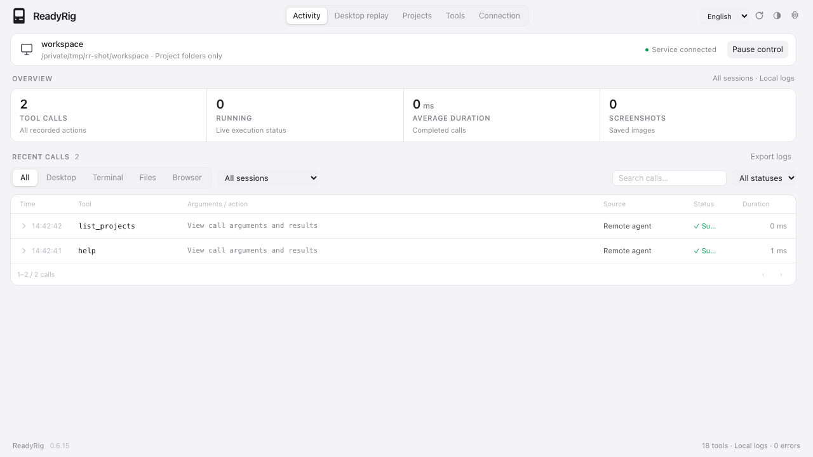

# ReadyRig — Local Agent Adapter

ReadyRig is a local tool service written in Go with a Wails desktop console. It lets remote agents use REST or MCP to work with local files, run commands, and capture and control the macOS desktop, while keeping execution logs available on your computer. It also bridges the official Chrome DevTools MCP tools into the same interface.

[Website](https://readyrig.getmegaportal.com/) · [Cloud console](https://readyrig.getmegaportal.com/console) · [Releases](https://github.com/jo32/readyrig/releases) · [Changelog](CHANGELOG.md)



The website, desktop app, local browser console, and cloud device console support English and Simplified Chinese. Choose a language or follow the system setting in the top-right corner. Native menus, authorization dialogs, connection prompts, and status messages follow the same preference. The desktop app saves its language in `language.json` in the private data directory.

## Getting started

Building from source requires Go 1.25+. The macOS desktop build also requires Xcode Command Line Tools. The core application needs no Node.js, npm, or frontend bundler; the optional Chrome MCP integration requires Node.js.

```sh
make app
open dist/ReadyRig.app
```

To run directly with a workspace:

```sh
go run ./cmd/adapter --workspace /absolute/path/to/workspace
```

To use the browser console with the same Go backend:

```sh
make cli
bin/readyrig-web web --workspace /absolute/path/to/workspace
```

Open the `Dashboard` URL printed in the terminal. Its startup key is exchanged for an HttpOnly, SameSite=Strict cookie and removed from the address bar after login. The agent API uses a separate random access path and needs no Authorization header.

Default locations and addresses:

- Workspace: `~/agent_workspace`.
- Data: `~/.local/share/readyrig/` for new installations, containing SQLite logs, screenshots, and application data. Existing installations reuse their previous directory; see [Compatibility](#compatibility).
- Agent API: `http://127.0.0.1:7332/<random-8-character-path>`. Copy the actual URL from the startup output or Connection page.
- Browser console: `http://127.0.0.1:7331`, in `web` mode only.

The initial data directory must be outside the initial workspace. Adding a project that contains the data directory, or enabling Full Access, expands what file tools can access.

## Using the console

- **Activity** shows live status, filters by session, category, and result, searches arguments and errors, and provides request/response details, pagination, and NDJSON export. Command output updates during execution without consuming unread `write_stdin` output. Individual calls can be cancelled while retaining their output.
- **Desktop replay** displays saved screenshots and action markers frame by frame or as playback, with a timeline and speed controls. It loads screenshots and actions from up to the latest 5,000 desktop calls. Playback displays history without executing actions again; missing frames are identified explicitly.
- **Tools** shows registered tools, JSON Schema, and example arguments. Test calls execute real operations and are logged. Detailed results load on demand, with readable terminal output, files, directory tables, and search results, plus expandable raw JSON.
- **Connection** provides the current agent URL and MCP configuration, system permission status, capability switches, sharing, and software updates.
- **Pause control** cancels active calls and terminal process groups and rejects new tool calls. Disabling one capability cancels only calls in that category.

File tools and Chrome detection are enabled by default. Chrome tools can be listed before the browser connects, but execution requires a ready debugging connection. Terminal and desktop operations must be enabled for each run locally, or explicitly through `--allow-shell` and `--allow-computer`. The agent API cannot change permissions or resume paused control. A bound cloud account can manage the supported switches described below.

On macOS, left-click the menu bar computer icon to open the quick panel; clicking outside dismisses it. Right-click for the native menu to open the full window, pause or resume, check for updates, or quit. Closing the main window keeps the service running; quitting stops it. The icon animates during tool execution, indicates pause, and respects Reduce Motion.

## Projects and Full Access

Add local folders on the **Projects** page. You can browse folders, rename projects, choose a default, and remove access. The project list and default are saved in `projects.json` in the data directory. `--workspace` supplies the initial folder only when this list is first created. Removing a project leaves its files and already running terminal commands intact.

- Agents call `list_projects {}` to obtain project IDs, absolute paths, the default project, and `full_access` status. This query also works while paused.
- `read_file`, `write_file`, `list_directory`, `search_files`, and `exec_command` accept an optional `project` ID. Relative paths use the default project unless another is specified. Absolute paths inside added projects are supported; when a project is explicitly selected, the path must belong to it.
- **Full Access** permits file paths and terminal working directories outside added projects, subject to the current system account's permissions. It lasts only for the current run and is disabled after restart unless started with `--full-access`.
- Full Access does not enable terminal, desktop, or Chrome capabilities, grant root privileges, or bypass macOS privacy permissions. The page links to Full Disk Access settings; restart after granting access to ReadyRig or the terminal app that launches it.
- Only the local console can modify project access or Full Access. Agents can query them. Active file operations finish before access is revoked. Logs include the actual file path or command `cwd` to identify the project used.

```json
{"project":"<id-from-list_projects>","path":"README.md"}
```

With Full Access enabled, file tools can use `{"path":"/Users/you/Documents/notes.txt"}` and terminal tools can use `{"command":"pwd","cwd":"/Users/you/Downloads"}`.

## Google sign-in and cloud device control

Under **Connection → Cloud account**, sign in with Google in the system browser, verify the code, and bind your computer to the account. The website and device console run on Cloudflare Workers; D1 stores accounts, device heartbeats, and commands.

Open the [cloud console](https://readyrig.getmegaportal.com/console) with the same Google account to manage bound computers. The app reports status and retrieves tunnel, capability, and pause/resume commands every 15 seconds, including when public sharing is off. Devices appear offline after 60 seconds without a heartbeat. Commands expire if not retrieved within five minutes, and execution results return to the web console.

The official deployment has Google sign-in configured and verified. See the [cloud deployment guide](cloud/README.md) for setup and verification, or use `--cloud-url` / `READYRIG_CLOUD_URL` with your own deployment. The web console manages only computers bound to the signed-in account. Unbinding revokes device credentials. Fixed tunnel credentials, project folders, Full Access, and operating system permissions remain locally configured.

## Chrome DevTools MCP

ReadyRig starts and bridges the **official Chrome DevTools MCP** subprocess, adding its tools to REST, MCP, OpenAPI, and the Tools page. The application and bridge are written in Go; the official MCP subprocess requires Node.js.

1. In Chrome 144+, open `chrome://inspect/#remote-debugging`, enable remote debugging, and keep Chrome running.
2. Install Node.js 20.19+, 22.12+, or a later supported version with npx. ReadyRig prefers `chrome-devtools-mcp` on PATH, otherwise it runs `npx --yes chrome-devtools-mcp@1.10.1`. Initial setup downloads and caches the component. Apps launched from Finder also search common Homebrew, Volta, mise, and nvm locations.
3. Check Chrome status in Connection or Tools. Allow Chrome's connection request when the first tool call prompts you.
4. Refresh `tools/list` through the current ReadyRig MCP URL to use tools such as `chrome_list_pages`, `chrome_take_snapshot`, and `chrome_click`. Follow the upstream schemas, including `pageId` where required. Clients that cache tools must refresh or reconnect; the gateway does not push tool-list changes.

ReadyRig checks stable Chrome's `DevToolsActivePort` and local `127.0.0.1:9222` every five seconds. It attaches to an existing Chrome instance without launching a browser or enabling debugging. Tool definitions load independently of the browser connection: while Chrome is unavailable or its debugging file requires authorization, tools remain listed as waiting for a connection, and calls return the corresponding explanation. ReadyRig switches to the detected debugging endpoint when it becomes available. A ready status can still require Chrome's approval on the first operation.

Custom debugging port, profile directory, or MCP executable:

```sh
bin/readyrig-web web --chrome-browser-url http://127.0.0.1:9223
bin/readyrig-web web --chrome-user-data-dir /absolute/path/to/chrome-profile
bin/readyrig-web web --chrome-mcp-command /absolute/path/to/chrome-devtools-mcp
```

Only local HTTP debugging URLs are accepted, without redirects or remote WebSocket endpoints. Profile discovery reads the debugging endpoint file rather than browsing history or account data. Use `--no-chrome` to disable startup detection, or the Chrome browser switch to disable it for the current run. Remote agents cannot change this setting.

Browser calls log arguments, duration, results, and failures and can be filtered by the browser category. The bridge preserves upstream schemas, annotations, text, images, and `structuredContent`. Browser screenshots appear in call details and JSON logs, but are excluded from desktop replay and desktop snapshot counts. Calls execute serially with a two-minute limit. Pause or cancellation disconnects the MCP subprocess; it reconnects after control resumes without closing your Chrome or retrying previously issued actions. Completed browser actions cannot be undone.

Chrome MCP can access the attached browser profile and may use upload/save tools to access local files available to your account. ReadyRig's file-tool project boundaries do not constrain those tools. Upstream usage statistics and CrUX queries are disabled by default. ReadyRig manages its own MCP subprocess; it cannot share another client's existing stdio process.

See the [upstream guide to connecting to a running Chrome instance](https://github.com/ChromeDevTools/chrome-devtools-mcp/blob/main/docs/advanced-usage.md#connecting-to-a-running-chrome-instance).

### Debugging file authorization on macOS

Chrome 144+ remote debugging exposes a WebSocket endpoint; a `404` from `/json/version` is expected in this mode. ReadyRig reads the local URL from `DevToolsActivePort` and passes it directly to the official MCP subprocess, which does not need to read the profile again.

If macOS blocks the file, click **Authorize debugging file** in the desktop app and select `DevToolsActivePort` inside the Chrome folder. ReadyRig then detects the endpoint again. Cancelling the dialog leaves permissions unchanged. If access is still denied, check ReadyRig's data access under **System Settings → Privacy & Security**; in browser mode, grant access to the terminal that starts ReadyRig. You must still approve the first browser connection in Chrome. Only the local desktop window can open this system dialog.

## Remote access and sharing

Under **Connection → Connect your agent**, select **Public → Temporary link** and start sharing to obtain a temporary HTTPS URL through **Cloudflare Quick Tunnels**, without a Cloudflare account or domain. ReadyRig uses an installed `cloudflared` first, including common macOS Homebrew paths. Otherwise it downloads the official GitHub release, verifies SHA-256, and stores it in the private data directory under `cloudflared/`. It leaves system installations unchanged and does not read existing named-tunnel configuration or login credentials for temporary sharing.

**Copy for your agent** generates a connection prompt for the selected local or public URL. Paste it into an agent with terminal or HTTP tools. It first calls `help` and `list_projects` to check the connection and authorized folders, then follows the supplied task or waits for one. Copying reads the current URL again; no prompt is provided before public sharing is ready.

Connection details and diagnostics are collapsed by default. Once sharing connects, you can copy the agent URL and MCP configuration, or open the read-only web console:

- Agent: `https://example.trycloudflare.com/aSsxba11`
- MCP: `https://example.trycloudflare.com/aSsxba11/mcp`
- Web console: `https://example.trycloudflare.com/aSsxba11/app/`

The full URL, including its eight-character access path, is a credential. Anyone holding it can use enabled tools and view logs and screenshots. The public console is read-only. It cannot change permissions, projects, Full Access, pause state, updates, or tunnel settings. REST/MCP retain the configured capability and folder restrictions. The tunnel forwards only the agent port, leaving the local management port private.

URLs become available only after connection succeeds; failures show an error and recent diagnostics. You can cancel connection, stop sharing, or reconnect. Sharing is off by default and does not resume automatically after restart. Stopping sharing or quitting stops `cloudflared` and clears the public URL. Temporary sharing receives a new domain whenever it starts, and its random path changes whenever ReadyRig restarts. Fixed sharing retains its domain and a separate access path, so restarting sharing restores the same full URL. Stopping fixed sharing immediately rejects new requests using that path.

To enable temporary sharing explicitly from the command line:

```sh
bin/readyrig-web web --share
# Optionally select an installed cloudflared executable.
bin/readyrig-web web --share --cloudflared /opt/homebrew/bin/cloudflared
```

### Fixed links

Fixed links use a remotely managed Cloudflare named tunnel:

1. Create a `cloudflared` tunnel in your Cloudflare account and copy its Tunnel Token.
2. Add a published application route for your domain, such as `readyrig.example.com`, targeting ReadyRig's **agent API**: service type `HTTP`, address `127.0.0.1:7332` by default. Use the current gateway port if changed; the console displays the service address.
3. Under **Public → Fixed link**, enter the domain and token, save, and start sharing. A full HTTPS URL or bare domain is accepted; paths, IP addresses, and temporary `trycloudflare` domains are rejected.

Fixed links require `cloudflared` 2025.4.0+ with `--token-file` support. The token and fixed access path are saved in a private configuration file readable and writable only by the current user. The UI reports whether a token is saved without returning it. Startup passes the token through a temporary `0600` file, removes it on exit, and excludes it from command arguments and diagnostics. The public console cannot read or modify this configuration. ReadyRig verifies that the fixed domain reaches the current instance before exposing links. Saving configuration does not start sharing, and restarting does not enable it automatically.

See [Cloudflare named tunnel setup](https://developers.cloudflare.com/tunnel/get-started/) and the [token-file parameter](https://developers.cloudflare.com/tunnel/reference/run-parameters/#token-file). Configure your account, domain, and DNS routes in Cloudflare.

Quick Tunnels provide temporary sharing without a stable domain or availability guarantee. They support up to 200 concurrent requests and do not support SSE. The public console refreshes every five seconds; MCP uses JSON HTTP responses. See the [official Quick Tunnels documentation](https://developers.cloudflare.com/cloudflare-one/networks/connectors/cloudflare-tunnel/do-more-with-tunnels/trycloudflare/).

## Agent tools and APIs

REST, MCP, OpenAPI, and the console share one tool registry.

| Tool | Purpose | Execution |
| --- | --- | --- |
| `help` | Current tool definitions and status, optionally by name | Concurrent; available while paused |
| `read_file` | UTF-8/Base64 reads and line ranges | Concurrent |
| `list_projects` | Read-only project folders, default, and Full Access status | Concurrent; available while paused |
| `write_file` | Atomic writes and parent directory creation | Serial |
| `list_directory` | Directory entries and file metadata | Concurrent |
| `search_files` | Text search with line numbers | Concurrent |
| `exec_command` | Commands with cwd, environment, timeout, and early session return | Concurrent |
| `write_stdin` | Input, polling, stdin closure, and process termination | Concurrent |
| `computer_screenshot` | Main-screen JPEG, longest edge 1,280 pixels | Serial |
| `computer_action` | Mouse, keyboard, scroll, and drag; captures the result by default | Serial |
| `chrome_*` | Dynamically discovered official Chrome DevTools MCP tools | Serial |

### Tool help

Call `help` with `{}` to obtain currently allowed tools, including names, descriptions, categories, complete `inputSchema`, upstream `outputSchema` and annotations, mutation and concurrency flags, and `enabled` / `available` status. Definitions come from the live registry.

Use `{"name":"exec_command"}` to inspect one tool even when disabled, or `{"include_disabled":true}` to include all registered tools and unavailable reasons (`capability_disabled` / `control_paused`). `available` reflects ReadyRig's capability and pause checks; operating system permissions and Chrome connection approval may still be required. Tools removed from the registry are absent from the list.

`help` is read-only, always enabled, works while paused, and is logged. Call it through `POST /api/v1/tools/help`, the MCP tool named `help`, or the local Tools page.

### REST

The path `aSsxba11` below is an example. Copy the actual URL from Connection:

```sh
export READYRIG_URL="http://127.0.0.1:7332/aSsxba11"
curl "$READYRIG_URL/api/v1/tools"

curl "$READYRIG_URL/api/v1/fs/read" \
  -H 'X-Session-ID: example-task' \
  -H 'X-Client-Name: My Agent' \
  -H 'Content-Type: application/json' \
  -d '{"path":"README.md","start_line":1,"end_line":20}'
```

All tools accept `POST /api/v1/tools/{name}`. These aliases and the OpenAPI endpoint are relative to `READYRIG_URL`, including its access path:

```text
POST /api/v1/bash/exec
POST /api/v1/bash/stdin
POST /api/v1/fs/read
POST /api/v1/fs/write
POST /api/v1/fs/list
POST /api/v1/fs/search
POST /api/v1/computer/screenshot
POST /api/v1/computer/action
GET  /api/v1/openapi.json
```

Responses use `{call_id, status, result, error}`. Tool execution failures return HTTP 422; paused control or disabled capabilities return 423. Nonzero command exits retain stdout, stderr, and `exit_code` and are marked as failures. Missing, incorrect, or previous-run access paths return 404; cross-origin browser requests return 403; exceeding 240 requests per minute returns 429.

### MCP

Local and temporary URLs get a new cryptographically random eight-character alphanumeric path at startup. All agent routes sit beneath it. Fixed links use a separately persisted path accepted only while fixed sharing is active. No Bearer Token is needed. Legacy `agent-token` files are retained but unused. Copy a new local or temporary configuration after restart:

```json
{
  "mcpServers": {
    "readyrig": {
      "url": "http://127.0.0.1:7332/aSsxba11/mcp"
    }
  }
}
```

MCP uses HTTP POST JSON-RPC. `initialize` returns `Mcp-Session-Id`, which subsequent requests must include. Supported operations are `initialize`, `ping`, `tools/list`, `tools/call`, and initialization notifications. The gateway supports protocol 2025-06-18 and single-request JSON transport compatibility with 2025-03-26. Legacy SSE, JSON-RPC batches, MCP stdio, and server-initiated requests are unsupported. Images are returned as separate MCP image content. See [Security boundaries and limitations](#security-boundaries-and-limitations) for disconnect behavior.

### Computer-use coordinates

1. Call `computer_screenshot` in the same session.
2. Read `frame_id` and `image_size` from the result.
3. Choose coordinates in the returned image's pixel space and send the `frame_id` with the action.
4. ReadyRig maps image pixels to macOS display points, including Retina scaling.

```json
{
  "action": "left_click",
  "frame_id": "<previous-frame-id>",
  "coordinate": [640, 360],
  "capture_after": true
}
```

Supported actions: `mouse_move`, `left_click`, `right_click`, `middle_click`, `double_click`, `drag`, `scroll`, `type`, and `key`. Drag uses `to: [x,y]`; scroll uses `scroll_delta: [horizontal,vertical]`; key combinations use `keys: ["cmd","c"]`. Coordinates must be within the image. Frames must belong to the current session and be less than five minutes old. Take a new screenshot after display layout changes. Post-action capture waits 200 ms before observing.

## Automatic updates

Release builds check GitHub Releases five seconds after startup and every six hours thereafter. New versions download in the background. The menu bar and **Connection → Software updates** show progress, release notes, and a restart/install action. Normal exit also installs a completed download. The service continues during downloads; restarting or quitting ends active calls.

The default release repository is [jo32/readyrig](https://github.com/jo32/readyrig). Private releases can use local `gh auth login` credentials, including Homebrew installations when launched from Finder, or `READYRIG_UPDATE_TOKEN` with read-only Contents access. Credentials go only to the GitHub API and are excluded from packages, logs, the console, and redirected downloads.

Updates match the current operating system, architecture, and desktop/browser build. ReadyRig verifies size and SHA-256, plus macOS app signature integrity, signing team, and bundle ID. Signed installations cannot downgrade to ad-hoc signatures. Downloads retry up to three times, duplicate checks are merged, completed downloads survive later network failures, and replacement failures roll back. Concurrent processes cannot update the same installation.

`dev` and source-description builds do not self-update. Read-only or Homebrew-managed installations show manual update instructions without requesting administrator privileges in the background. Restart restores launch arguments, initializes capabilities from those arguments, and generates a new local/temporary agent path. Browser mode requires login through the newly printed dashboard URL. Fixed sharing must be restarted to restore its saved URL.

```sh
bin/readyrig version                 # Show the current version.
bin/readyrig update                  # Check, download, and install; use the console if already running.
bin/readyrig --no-update              # Disable updates for this run; or set READYRIG_NO_UPDATE=1.
make app VERSION=0.5.0               # Builds without VERSION are marked dev.
make release VERSION=0.5.0           # Packages, binaries, and SHA256SUMS in dist/releases/0.5.0/.
```

Use `--update-repo owner/repo` / `READYRIG_UPDATE_REPO` to change the repository, or `--update-feed URL` / `READYRIG_UPDATE_FEED` for a Magpie-compatible feed with `{version, notes, url, assets: {filename: {url, size, sha256}}}`. Custom feeds require HTTPS; loopback HTTP is allowed for local testing.

Update management endpoints are local only: `GET /api/update`, `POST /api/update/check`, and `POST /api/update/restart`. Call detail and cancellation endpoints, `GET /api/calls/{id}` and `POST /api/calls/{id}/cancel`, are also local only. Agents terminate their own commands through `write_stdin`.

## Security boundaries and limitations

- **Files:** Go `os.Root` confines file operations to authorized projects by default, permits absolute paths within them, and rejects parent traversal and symlinks pointing outside. Full Access permits other directories under the current account's permissions.
- **Terminal:** Commands run as the current user through `/bin/sh` on the host. Working directories are restricted to projects unless Full Access is enabled, but commands can still access other paths, networks, and devices available to that user. There is no Docker execution backend, PTY, or Windows shell adaptation. Terminal access is disabled by default. Timeouts default to 60 seconds and are capped at 600 seconds; output is capped at 1 MiB per stream. Cancellation stops process groups, but intentionally detached processes require operating system sandboxing to constrain.
- **Desktop:** macOS requires Screen Recording and Accessibility permissions. The driver uses system screenshots and CoreGraphics input events, controls the main display with the real pointer, and has no accessibility element tree, background window input, OCR, browser extension, or display selector. Native Windows/Linux drivers return an explicit unsupported error. Input is rejected when the pointer is at a screen corner; drags check cancellation and corner conditions and release held buttons. Pause cannot undo completed actions.
- **Network:** Agent and management interfaces are separate. Access paths use constant-time comparisons. REST/MCP reject browser Origin headers; the public read-only console permits same-origin GET/HEAD. The local console defends against cross-site requests and DNS rebinding. `--allow-ip 127.0.0.1/32,::1/128` restricts directly connected peers; client-supplied forwarded IPs are not trusted.
- **Logs and credentials:** Per-run random paths stay in memory, and data directories are created with `0700` permissions. Logs redact token/password/secret fields, the current random path, and dashboard key, but cannot identify every secret in free text or images. Treat logs and screenshots as sensitive local data. Logs persist without automatic cleanup or quotas. SQLite records call start and completion; restart marks unfinished calls as `interrupted`. Long-running command output is saved as it changes, and final results are recorded without client polling. Screenshots are stored separately from list summaries.
- **Shared access:** Holders of an agent URL share one authorization identity. Sessions correlate logs rather than isolate tenants. Writes and clicks are not automatically retried. Turning off public sharing does not itself cancel commands already running.
- **MCP:** The gateway implements a limited subset without claiming full protocol certification. A disconnect may cancel the current request; check logs before reconnecting and repeating an operation whose outcome is unknown. Quick Tunnel web, REST, and MCP access have been verified; integration with real cloud agent clients remains unverified.
- **Distribution:** Official Mac releases require Developer ID signing, hardened runtime, a secure timestamp, and Apple notarization. App bundles receive a stapled notarization ticket before packaging. Versions 0.6.0 and earlier used ad-hoc signing; switching from those installations to Developer ID requires one manual installation. Later updates must retain the signing team and bundle ID. System permissions may need to be granted again when the build identity changes.

## Development and verification

```sh
make test                       # Go race tests.
node --check internal/server/assets/app.js
node --test scripts/test-i18n.cjs
make build                      # Native Wails application.
make cli                        # Browser/headless binary.
```

For the website and cloud service, see [website/README.md](website/README.md) and [cloud/README.md](cloud/README.md).

```text
cmd/adapter/         Launch options, HTTP entry points, application lifecycle
internal/brand/      Shared ReadyRig icon assets
internal/harness/    Tool specs, registry, dispatch, pause, files, projects, terminal
internal/chromemcp/  Chrome discovery, official MCP stdio bridge, dynamic tools
internal/cloud/      Account binding, device credentials, heartbeats, command receipts
internal/tunnel/     Temporary/fixed tunnels, credentials, validation, downloads, diagnostics
internal/computer/   Replaceable driver, screenshot compression, coordinates, macOS input
internal/store/      SQLite logs, filters, sessions, crash recovery
internal/server/     REST, MCP, authentication, OpenAPI, events, embedded console
internal/desktop/    Wails window and menu bar
internal/i18n/       Native menu and dialog translations
internal/update/     Release authentication, downloads, verification, exit installation
internal/buildinfo/  Build version and release repository
scripts/             Packaging and integration checks
website/             React website and cloud device console
cloud/               Cloudflare Worker, D1 migrations, cloud API
```

Tests cover file traversal and symlink escape, file operations, validation, redaction, pause and queued cancellation, stdin and asynchronous processes, timeout and process-group termination, output limits, final audit records, MCP initialization/calls, access-path authorization and rotation, Origin/CSRF/DNS rebinding, log recovery, Retina mapping, expired and cross-session frames, individual cancellation, capability isolation, live output without consuming agent reads, and summary/detail loading. Chrome tests cover subprocess protocols, paginated discovery, complex schemas, image/structured results, failures, cancellation/reconnection, disabling, and local address validation. Tunnel tests cover subprocess lifecycle, duplicate starts, cleanup, configuration isolation, readiness/timeouts, diagnostic limits, checksum verification, path/archive boundaries, and public read-only routes. Tests do not open real public tunnels or operate your desktop automatically.

`python3 scripts/test-update.py` verifies a real binary update from 0.4.0 to 0.5.0 and restart in a temporary directory, retaining logs and workspace data.

The [release workflow](.github/workflows/release.yml) tests and builds macOS Intel/Apple Silicon desktop packages and macOS/Linux/Windows browser binaries for both architectures, then publishes GitHub Releases when a `vX.Y.Z` tag is pushed. Missing Developer ID or notarization credentials stop the release; existing releases are not overwritten. Local `make release` runs the same signing and notarization steps without uploading. Mac app packages and `SHA256SUMS` are generated only after Apple accepts the submission and the bundles pass ticket validation and Gatekeeper assessment.

For local releases, set `SIGN_IDENTITY` to a Developer ID Application name or fingerprint and optionally set `SIGN_KEYCHAIN`. Authenticate notarization with an existing `NOTARY_PROFILE` (and optionally `NOTARY_KEYCHAIN`), or use a team API key through `NOTARY_KEY_PATH`, `NOTARY_KEY_ID`, and `NOTARY_ISSUER_ID`. To build first and notarize later, run `VERSION=0.6.1 sh scripts/release.sh --prepare`, then run `sh scripts/release.sh --finish` with the same version and notarization credentials. Development `make app` builds can still use ad-hoc signing.

CI requires these GitHub Secrets: `MACOS_CERTIFICATE_P12_BASE64`, `MACOS_CERTIFICATE_PASSWORD`, `APPLE_NOTARY_KEY_BASE64`, `APPLE_NOTARY_KEY_ID`, and `APPLE_NOTARY_ISSUER_ID`. Signing credentials stay in a temporary keychain and temporary files, are removed afterward, and never enter the repository or release assets.

## Compatibility

The product name is **ReadyRig**, the desktop bundle is `ReadyRig.app`, and commands are `readyrig` / `readyrig-web`. The website and app share `internal/brand/assets/readyrig-app-icon.png`.

If `~/.local/share/readyrig` does not exist, ReadyRig reuses an existing `~/.local/share/readrig` or `~/.local/share/relay`, in that order, preserving projects, logs, and sharing configuration without moving or deleting data. The signing identifier remains `dev.local.relay` for system permission and update verification compatibility.

Update configuration uses `READYRIG_UPDATE_REPO`, `READYRIG_UPDATE_FEED`, `READYRIG_UPDATE_TOKEN`, and `READYRIG_NO_UPDATE`. Corresponding legacy `RELAY_*` variables remain fallbacks when the new variables are unset.

Release scripts produce primary `readyrig-*` packages and compatibility `readrig-*` / `relay-*` assets so existing clients can find updates. Compatibility desktop bundles retain their old folder and executable names while displaying ReadyRig. Historical release names remain unchanged.

## Design references and attribution

- [Codex](https://github.com/openai/codex): tool specifications, registry/executor separation, dispatch lifecycle, and progressive `exec_command` / `write_stdin` output. Reference commit: `94d642d8b40e45e2e544770f0d1f28df9a717f06` from a shallow, sparse checkout of main.
- [Magpie](https://github.com/yetone/magpie): Go, Wails v3, embedded HTML/CSS/JS, shared desktop/web HTTP handlers, compact information density, and call tracing. Reference commit: `74834748b98daeb295bf78b38170967e426e0c59`.
- [Product research](docs/product-research.md): Cua Driver, Peekaboo, Munim, Gokin Studio, Go MCP servers, and Bytebot, including reusable capabilities and unverified claims.

The execution backend is independently implemented. The console reuses Magpie's MIT-licensed theme variables, segmented navigation, statistics, and call-detail styles; see `internal/server/assets/MAGPIE-LICENSE.txt`. Automatic updates reference Magpie commit `575a8f5fe3bba6ca22f8ec0509eb3af88100aac0`, with attribution in `internal/update/MAGPIE-LICENSE.txt`. Future third-party drivers require separate API, license, and distribution reviews.
